# MDS5102 Report

## SID:221041014 Date:2021.10.14

## Question 1

- Code for this question is saved in q1.py.

- The program allows the user to input a integer N between 0 and 500, and then displays the first N emirps, 10 numbers per line.

- The input numbers should be **integers N**. 
- The output would be **the first N emirps**.

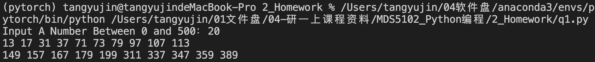

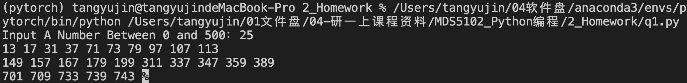

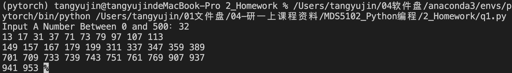

## Question2

- Code for this question is saved in q2.py.
- The program allows the user to select a function, the start,the end and calculate the integration.
- The input includes function name(**sin,cos,tan**), start-**a**, end-**b**, and division-**N**.
- The output is the **integration outcome**.

Note: If the user input wrong function name or if a>b, the procedure will break and remind the user.

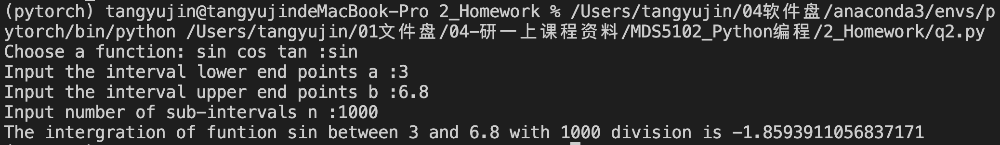

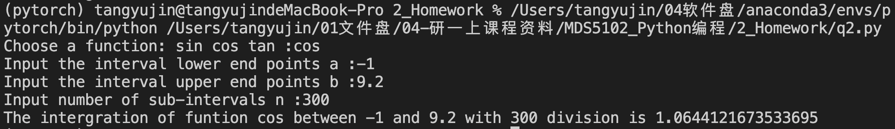

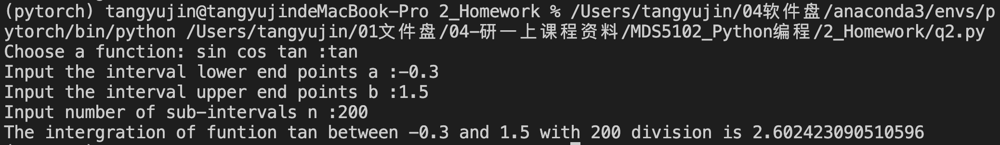

**Wrong input cases**:

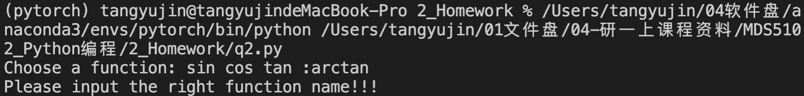

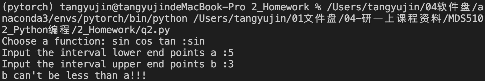

## Question3

- Code for this question is saved in q3.py.
- The prgram solves **Locker puzzle** problem.
- The program **does not have input**.
- The outputs are **all indexes** of lockers that are **opened**.

## Question4

- Code for this question is saved in q4.py.
- The prgram realize the basic function of Binary Tree.
- The program **does not have input**.
- The outputs are the print ountcome of **some test cases**.

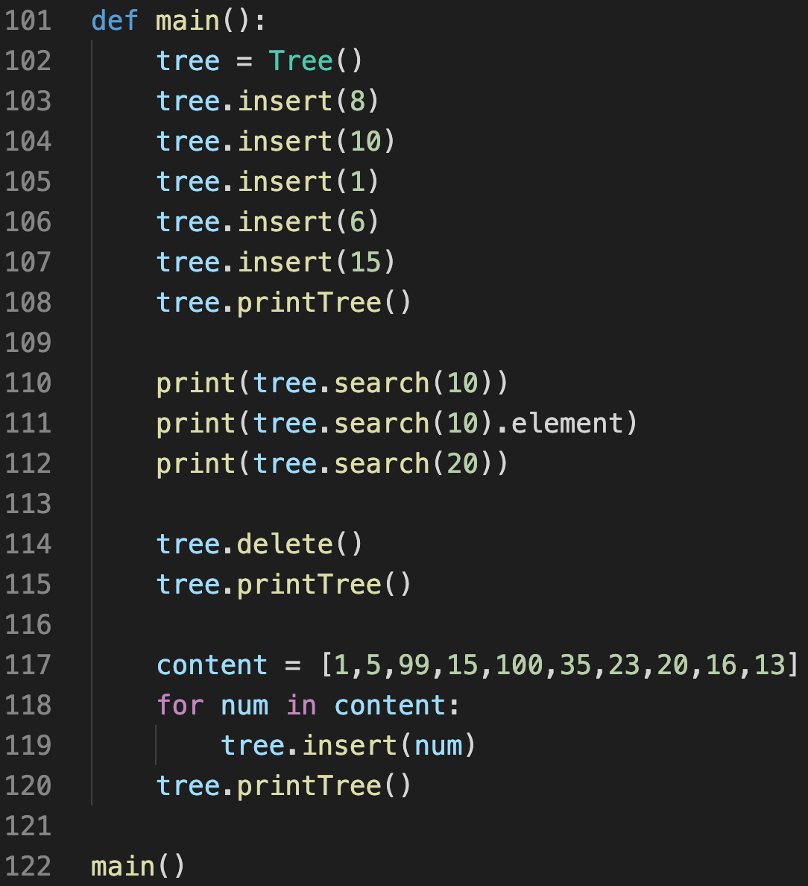

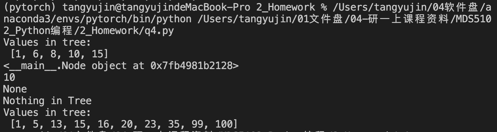

## Question5

- Code for this question is saved in q5.py.
- The prgram returns a list of all possible permutations of input list.
- The program inputs a list of integers with no duplicated elements, eg 3,5,6, the input number is interbaled by **",".**
- The outputs are the **number of permutations** and **all the possible permutations**.

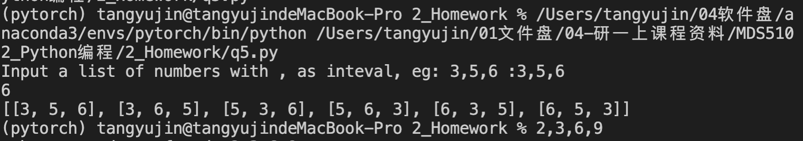

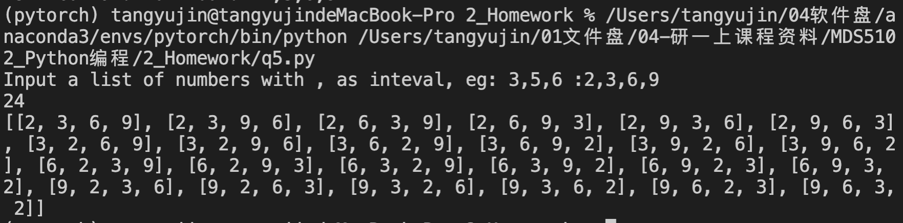

